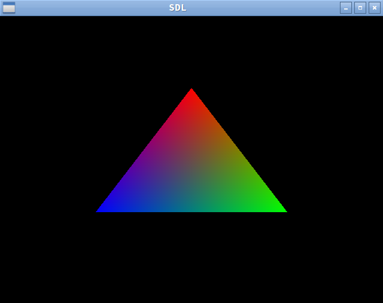

===
# OpenGL3 Boilerplate Code
===

This is a single-file OpenGL "hello world" boilerplate implementation. It
assumes that SDL and GLEW are already installed.

```cpp
#include <GL/glew.h>
#include <SDL2/SDL.h>
#include <stdio.h>
#include <string>

const std::string vs =
    "#version 330\n"
    "layout(location = 0) in vec4 position;\n"
    "layout(location = 1) in vec4 color;\n"
    "smooth out vec4 vertex_color;\n"
    "void main() {\n"
    "   gl_Position = position;\n"
    "   vertex_color = color;\n"
    "}\n"
    ""
    ;

const std::string fs =
    "#version 330\n"
    "smooth in vec4 vertex_color;\n"
    "out vec4 out_color;\n"
    "void main() {\n"
    "   out_color = vertex_color;\n"
    "}\n"
    ""
    ;

bool create_shader(GLenum shader_kind, const char* shader_src, GLuint* out_shader) {
    GLuint shader = glCreateShader(shader_kind);
    glShaderSource(shader, 1, &shader_src, NULL);
    glCompileShader(shader);

    GLint status;
    glGetShaderiv(shader, GL_COMPILE_STATUS, &status);
    if (status == GL_FALSE) {
        GLint log_len;
        glGetShaderiv(shader, GL_INFO_LOG_LENGTH, &log_len);

        GLchar log[4096];
        glGetShaderInfoLog(shader, log_len, NULL, log);

        const char* kind;
        switch (shader_kind) {
            case GL_VERTEX_SHADER: kind = "vertex"; break;
            case GL_FRAGMENT_SHADER: kind = "fragment"; break;
            default: kind = "unknown"; break;
        }
        fprintf(stderr, "Compile failure in %s shader: %s\n", kind, log);
        return false;
    }
    *out_shader = shader;
    return true;
}

bool build_shader_program(const char* vs, const char* fs, GLuint* out_program) {
    GLuint vshader;
    GLuint fshader;

    if (!create_shader(GL_VERTEX_SHADER, vs, &vshader)) return false;
    if (!create_shader(GL_FRAGMENT_SHADER, fs, &fshader)) return false;

    GLuint program = glCreateProgram();

    glAttachShader(program, vshader);
    glAttachShader(program, fshader);

    glLinkProgram(program);

    GLint status;
    glGetProgramiv(program, GL_LINK_STATUS, &status);
    if (status == GL_FALSE) {
        GLint log_len;
        glGetProgramiv(program, GL_INFO_LOG_LENGTH, &log_len);

        GLchar log[4096];
        glGetProgramInfoLog(program, log_len, NULL, log);
        fprintf(stderr, "Shader linker failure: %s\n", log);
        return false;
    }

    glDetachShader(program, vshader);
    glDetachShader(program, fshader);

    *out_program = program;
    return true;
}

int main() {
    if (SDL_Init(SDL_INIT_VIDEO) < 0) return 1;
    SDL_Window *window = SDL_CreateWindow("SDL",
        SDL_WINDOWPOS_UNDEFINED,
        SDL_WINDOWPOS_UNDEFINED,
        640, 480,
        SDL_WINDOW_SHOWN | SDL_WINDOW_OPENGL
    );

    SDL_GLContext gl_context = SDL_GL_CreateContext(window);
    if (gl_context == NULL) {
        fprintf(stderr, "Error in creating the OpenGL context\n");
        return 1;
    }

    const unsigned char* version = glGetString(GL_VERSION);
    if (version == NULL) {
        fprintf(stderr, "Error in getting the OpenGL version\n");
        return 1;
    }

    SDL_GL_MakeCurrent(window, gl_context);

    SDL_GL_SetAttribute(SDL_GL_CONTEXT_MAJOR_VERSION, 3);
    SDL_GL_SetAttribute(SDL_GL_CONTEXT_MINOR_VERSION, 3);

    // MUST make a context AND make it current BEFORE glewInit()!
    glewExperimental = GL_TRUE;
    GLenum glew_status = glewInit();
    if (glew_status != 0) {
        fprintf(stderr, "GLEW init error: %s\n", glewGetErrorString(glew_status));
        return 1;
    }

    const float triangle_vertices[] = {
        // position
         0.0f,  0.5f,   0.0f, 1.0f,
         0.5f, -0.366f, 0.0f, 1.0f,
        -0.5f, -0.366f, 0.0f, 1.0f,

        // color
        1.0f, 0.0f, 0.0f, 1.0f,
        0.0f, 1.0f, 0.0f, 1.0f,
        0.0f, 0.0f, 1.0f, 1.0f
    };

    GLuint shader_program;
    if (!build_shader_program(vs.c_str(), fs.c_str(), &shader_program)) {
        SDL_Quit();
        return 0;
    }

    GLuint vao;
    glGenVertexArrays(1, &vao);
    glBindVertexArray(vao);

    GLuint triangle_vbo;
    glGenBuffers(1, &triangle_vbo);

    glBindBuffer(GL_ARRAY_BUFFER, triangle_vbo);
    glBufferData(
        GL_ARRAY_BUFFER,
        sizeof(triangle_vertices),
        triangle_vertices,
        GL_STATIC_DRAW
    );
    glEnableVertexAttribArray(0);
    glEnableVertexAttribArray(1);
    glVertexAttribPointer(0, 4, GL_FLOAT, GL_FALSE, 0, 0);
    glVertexAttribPointer(1, 4, GL_FLOAT, GL_FALSE, 0, (void*)48);
    glBindVertexArray(0);

    bool running = true;
    while (running) {
        SDL_Event e;
        while (SDL_PollEvent(&e)) {
            if (e.type == SDL_QUIT ||
                (e.type == SDL_KEYUP && e.key.keysym.sym == SDLK_ESCAPE)) {
                running = false;
            }
        }

        glClearColor(0.0, 0.0, 0.0, 0.0);
        glClear(GL_COLOR_BUFFER_BIT);

        glUseProgram(shader_program);
        glBindVertexArray(vao);
        glDrawArrays(GL_TRIANGLES, 0, 3);
        glUseProgram(0);

        SDL_GL_SwapWindow(window);
        SDL_Delay(20);
    }

    SDL_GL_DeleteContext(gl_context);
    SDL_Quit();
    return 0;
}
```sdl2-opengl.cpp

Compile with:

```sh
g++ sdl2-opengl.cpp -Wall -lSDL2 -lGL -lGLEW
```



