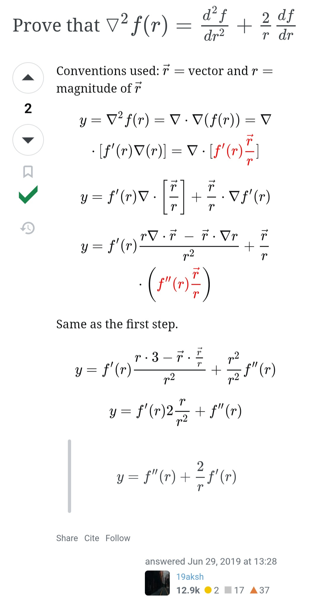

## 14.10.25

To even begin reading Spivak's Calculus, I need to have a few prerequisites under my belt:

1. Know Pre-algebra, Algebra, Trig, Pre-calculus. Every engineering student has done this at some point. 
2. Calc I, II, III on a surface level—just enough to solve problems, no proofs or derivations or anything. Recommended: Paul's Online Notes or Michel van Biezen's ~13hr YouTube playlist.
3. Proof writing. Recommended: How to Prove It: A Structured Approach by Daniel J. Velleman

Currently I'm working on finishing the 2nd part. Even though I'm in Semester III in my college which involves Calc III, I feel like we weren't taught stuff properly, which is why I'm relying on Paul's notes to get basics of Calc 2 and 3 out of the way so that I can move on to step 3. 

## 13.10.25

Our college student association planned a trip to Visapur, Lonavala for a hike to the Visapur Fort. I came back from the trip last night. It was a pretty cool 2-day excursion considering we have our endsems next month. Last I went hiking on a mountain was probably 7 years ago, so I was pretty certain I'd be half dead from exhaustion after the hike; but it wasn't so bad. 

## 29.9.25

On the first few lessons from the Udemy piano course. Before this I could play melodies with single hand without movement. Now the first full lesson incorporates some bass notes too. What helped me was to individually practice both hands until I'm fairly confident that I could play them without thinking too much. Then after however many tries, playing with both hands should be much easier.

I'm also starting to get a hang of which notes are which on the keyboard. The accidentals are not yet introduced in the course, so I'm gonna hold off till later on that. 

Pitch recognition by ear is tricky. Some say it's given to you by birth, while others assert it can be taught just like any other skill. I think it's a mix of both. All the "pitch perfect" musicians I've come across have done some music in their childhood, that helped them develop this "natural-born" talent gradually.

One of the ways pitch recognition can be done without being born with it, is to link a note with the first note of any song. For example, Hans Zimmer's No Time To Caution has a memorable `A` `B` `C` `D` melodic arrangement, which can be used to recognize other similar notes. 

Also, about a week ago I came across a really cool vector calculus problem solution, thought I'd share it here:

