Software developers are a brilliant breed, but at the end of the day they're humans, and humans have are not prone to infallibility. Perhaps their greatest potential weakness is not knowing when to stop. Much like a painter, knowing when to put down their tools and stepping back is a really nice trait to have. Feature creep as it turns out is very real after all.

Last I used the Arduino IDE some 5-6 years ago was for a school project. Now a few days ago I had to spin it up for another college project I'm working on, and when I saw its interface, I vividly remembered why I hated the industry I'm now part of.

For those of you who don't know, the Arduino IDE originally had only one version, with the latest being 1.8. The developers then started to work on a newer, "improved" version from the ground up. Now, whenever you go to [arduino.cc](https://arduino.cc), you get the option to choose which IDE version to download: the 1.8 "legacy" version or the newer version 2.

Here is how the legacy version's installer looked like:

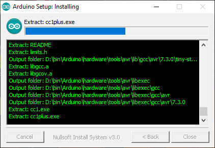

And here is the newer version's installer:

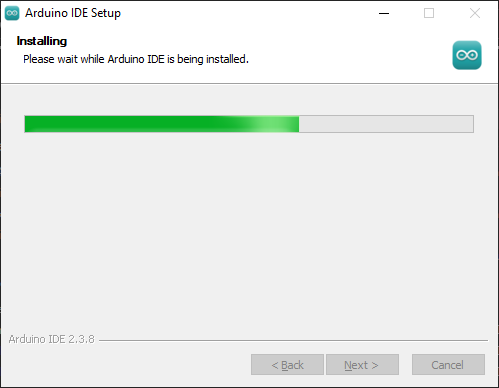

See the information packed in the former's interface? The legacy version trusted the user and shared all that's happening during installation, which could be handy in troubleshooting. The newer version's design seems to imply "you don't want to know how we're installing it, just trust us!". Now this is not entirely their fault: they could be using a premade program installer like Inno Setup. But then why change what already works? 

Same goes for the splash screen: fun-themed vector illustration replaced with a generic 2D-bouncing logo.

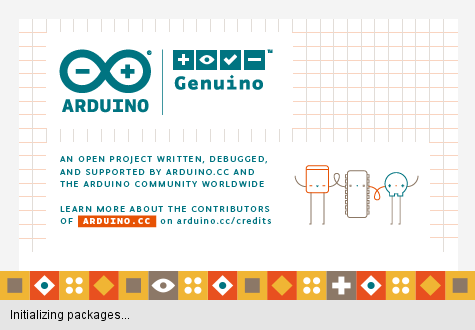

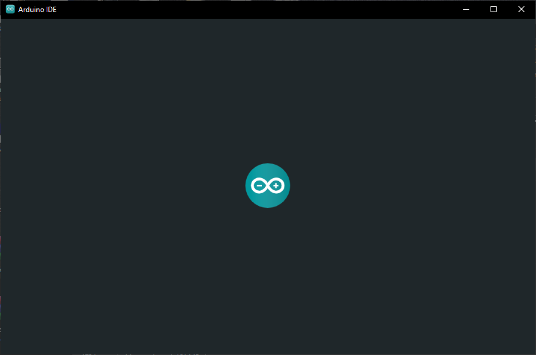

[[[
The argument that the newer version doesn't have a splash screen and loads faster than the legacy version is bullshit. If it takes even a noticable time to reach the desired screen, it most definitely is a splash screen. I do not condone splash screens btw.
]]]

But in my opinion the biggest offender was the native to web-app shift. Just look at the difference between the native version's Windows UI controls versus the inconsistent mess we got with the newer version:

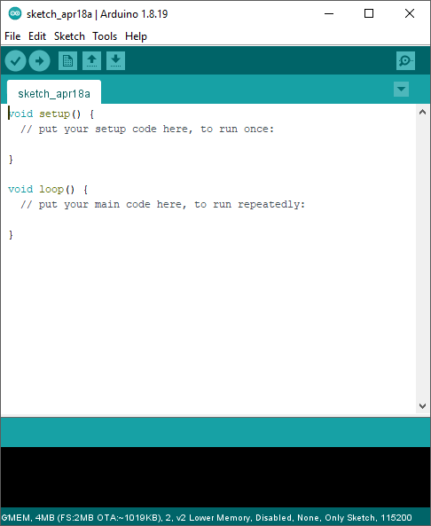

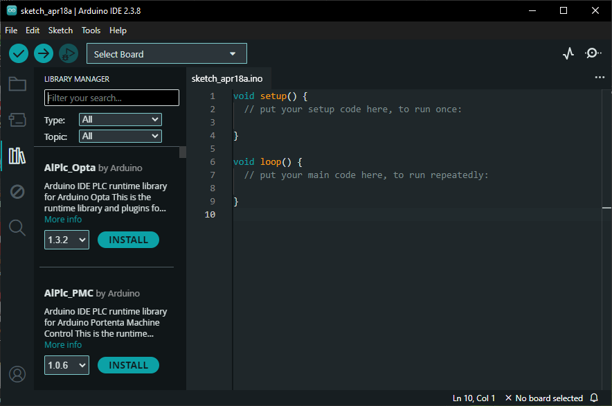

UI elements are consistent in style, shape and size compared to the webapp which does not have a design language to adhere to. Here is a more nuanced example:

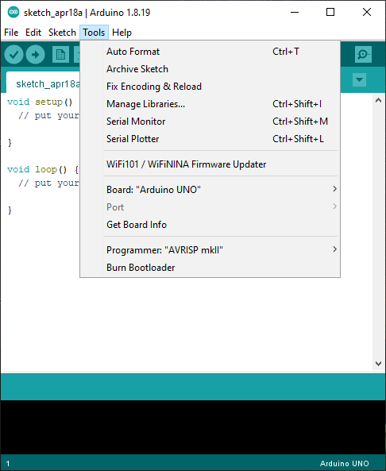

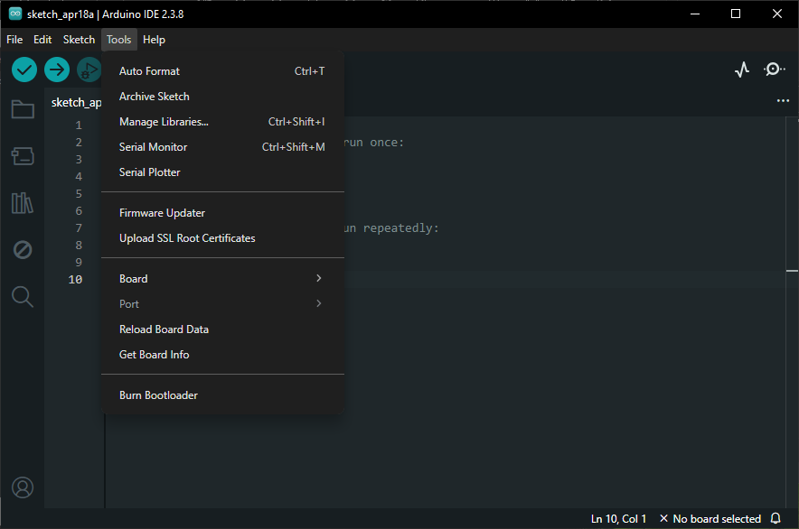

Dropdown menu is outlined and separated from the editor using a different color in the native, whereas the webapp's menu is too similar in color to the background without any outline to help. And in my book tight information packing is a plus which is a win for the former, in contrast to the webapp's menu which contains unnecessary extra padding between elements. The nail in the coffin are the rounded corners on the menu which does not fit with the squared-off style of the rest of the IDE of the webapp's. Here's another example of the rounded UI elements:

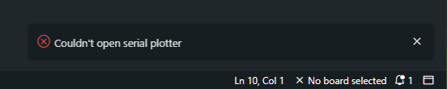

The notification messages hide the background output terminal when they appear, only disappearing after a timeout or clicking X.

Even if you think the points I'm making are trivial and no one will notice these subtleties in their everyday use, there is still one evil deed left which in my opinion will never be trivial. 

Taking a look at the memory footprints of both apps after opening and using the IDE for approx. 2 minutes, we get this:

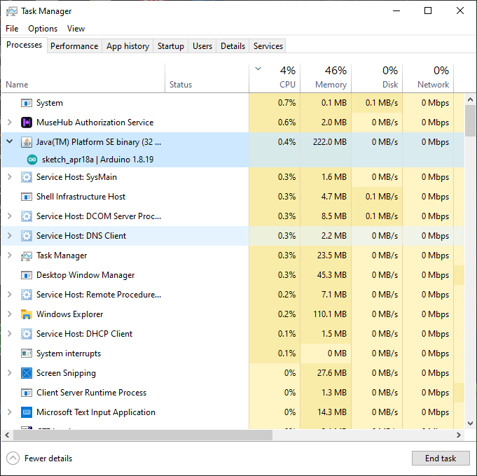

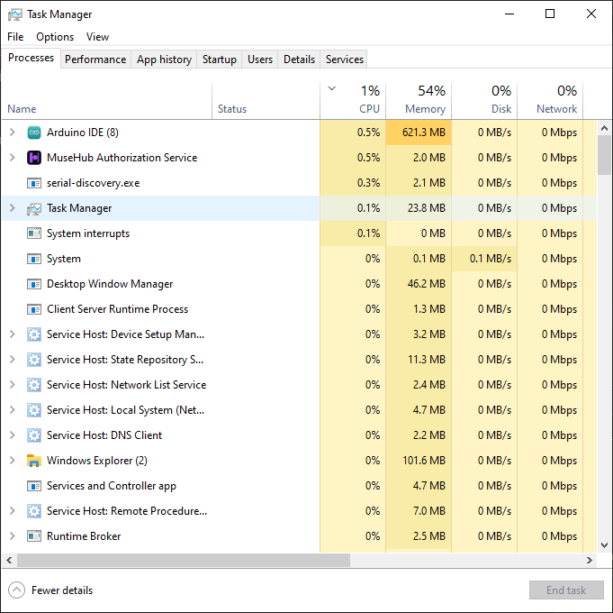

Memory usage of the webapp is roughly 280% of the native's! The developers shited from writing native front-end UI for each platform to now maintaining just one front-end codebase written using Chromium/Electron. I can understand the need for this transition, but I know there are better alternatives out there than _Electron_.

To be honest even though I hate AI and everything pertaining to it, it did one thing right: increase RAM prices. It's better to write efficient code than to throw hardware at it. Perhaps RAM scarcity will drive developers to think more about memory utilisation and build software with memory footprint in mind.