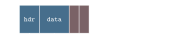
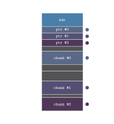
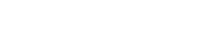

Some time ago I wrote an [article](/blog/c-macros-as-a-poor-mans-std-vector.html) on creating generic arraylists using C macros. Because they are _the_ building block of other data structures, it is impossible to overstate their value. But there is one non-trivial problem that normal arraylists can't solve -- let me show you what I mean.

Suppose we have a memory buffer like so:


And assume that our memory buffer is managed by the C library `malloc`. Let's initialize our arraylist:


Our memory allocator, in this case `malloc`, reserves a chunk of memory for `bufhdr` and the trailing data where our arraylist can store items. I've color-coded this so dark gray represents allocated but unused, because we haven't pushed any items into it yet. 

Now let's suppose that some other code requests `malloc` for a chunk of memory immediately after initializing our arraylist. The memory now looks like so: 


So far so good. Now we push items into the arraylist until we hit the maximum capacity:


Uh oh! We've reached the end of our allocated space, i.e. the arraylist is at capacity. Let's walk through what would happen if we try to push one more element:

- Our code checks to see if `bufcap(b) >= 1 + buflen(b)`. This returns false, so we call `_bufgrow`.
- `_bufgrow` calculates the new capacity and `realloc`s the previously allocated data to a new location (it cannot be expanded in place due to other `malloc` calls).

The memory layout finally looks like this:


Notice a "hole" in the memory at the beginning. Repeat this operation a thousand times, and you get a fragmented memory space, where free and used blocks are interleaved. Even though there is enough total memory available, the memory is discontiguous enough that any sufficiently large request for memory may eventually fail.

A better way to manage memory allocations is to group them by their lifetimes. This is often called an arena. For example, all the enemies in a particular level of a game can share an arena, and at the end of the level, the arena can be instantly deallocated without individually freeing all the enemy objects. This would free the whole arena memory, which could be reused for some other level.

But arenas do not solve our problem entirely. Sometimes we cannot predict the amount of space we'd require ahead of time, resulting in frequent reallocation of data. A good example is a tokenizer. We can't really predict the number of tokens we'd require in advance. We can only make an educated guess based on some input, like the length of the source code for example.

Another problem arises when we increase the number of arraylists in our program. If many of them use the same arena for their allocations, then the chances of collision when a list needs to expand increase. Or the arenas themselves can collide with each other if a sufficient gap between them is not kept. 

But we're getting ahead of ourselves. Let's first see how a simple arena allocator is implemented.

```c
typedef struct {
    const char* name;
    char* base;
    usize capacity;
    usize pos;
} Arena;
```

We define a simple four-field type for an `Arena` where `name` is the debug name for an arena, `base` is the starting address, `capacity` is the length in bytes, and `pos` is the current offset into the arena.

```c
Arena arena_create(const char* name, u64 reserve) {
    Arena arena = (Arena){};
    arena.name = name;
    void* ptr = mmap(NULL, reserve, PROT_READ | PROT_WRITE,
        MAP_PRIVATE | MAP_ANONYMOUS | MAP_NORESERVE, -1, 0);
    if (ptr != MAP_FAILED) {
        arena.base = ptr;
        arena.capacity = reserve;
    }
    return arena;
}
```

This creates an arena, taking in a name and a size to reserve. Now we get to the interesting part. The `mmap()` call reserves a virtual address block (but not physical memory) of the specified size. Due to demand paging, even if the requested memory is orders of magnitude higher than the physical memory available, the kernel will not reserve any pages until the memory is accessed. We also pass the `MAP_ANONYMOUS` flag because we don't need a file backing the mapping.

```c
void* arena_push(Arena* arena, u64 size) {
    u64 aligned_size = (size + 7) & ~7;
    assert(arena->pos + aligned_size <= arena->capacity && "Arena out of memory!");
    void* ptr = arena->base + arena->pos;
    arena->pos += aligned_size;
    return ptr;
}
```

This works like `malloc()`: it takes a size and returns a pointer, rather than copying an object into the arena.

```c
void arena_clear(Arena* arena) {
    arena->pos = 0;
}

void arena_destroy(Arena* arena) {
    if (arena->base) {
        munmap(arena->base, arena->capacity);
    }
}
```

These trivial functions deal with clearing and deinitializing arenas. They clear/destroy the whole arena at once, which is primarily what an arena is used for. 

Our arena implementation is complete, but not enough for our purposes. Why? Let me reiterate our problem statement. What we want is a collision-free way of allocating objects, where an arraylist can grow infinitely without colliding with another allocation. Some of you might think that this can be easily solved by `mmap`ing a huge 1TB block of virtual memory and segregating that block into granular address spaces for each arraylist. The kernel then wouldn't allocate physical pages for memory that's never written to. But this presents us with a few problems:

- Some embedded systems do not support demand paging, so any allocation will commit physical RAM.
- Even on desktop Linux (and other OSes) the overcommit behavior depends on kernel flags like `vm.overcommit_memory`, where the kernel will not let you reserve virtual address spaces exceeding `swap + (ram * overcommit_ratio)` if the proper value is not set.
- Modern kernels use 4 or 5-level page table hierarchies, where each page table consumes 4KB. If you write a single byte to an address far into the memory space, the kernel will have to allocate intermediate page tables (PUD, PMD, and PTE) to map the physical page.
- It puts a hard limit (depending on the granularity of division of 1TB space) on the size of arraylists. Maybe an application needs to store 10GB worth of stuff in one arraylist. But it won't be able to if the block size is restricted to only 1GB.

So what _can_ we do? Let's go through it step by step. Let's assume that a default number of elements is allocated for every arraylist on initialization. Then, as the arraylist fills up, its length will eventually equal its maximum capacity. At this point, no further elements can be stored in it. We already know that capacity cannot be extended in place (collision with other allocations), but what if we start pushing new elements to the end of the arena? 



In other words, we keep the old data as it is, and carve out a new "chunk" of memory from the arena store new elements in. If this new chunk fills up again then we repeat the process, requesting another block from the arena. It doesn't matter if our chunks are discontiguous: that's the whole point. We reserve a whole chunk worth of memory from the arena even if only a single element needs to be stored. Later on, if any code requests memory from the arena, it will get a block following our chunk. This is exactly why the list is split into chunks.

This makes pushing elements to the list trivial, but what about accessing elements from the list? Currently we have no way of knowing where all of our chunks are located. As far as the arraylist is concerned, they might as well be garbage.

Some of you may see the solution already. What if we store individual pointers to chunks in the header? From our previous example, when a full arraylist is pushed to again, it can request the arena for a chunk and store the chunk's address in its header, something like this:

        Chunk #0 => 0xfffdffe0c24deb70 (the "default" chunk)
    --> Chunk #1 => 0xfffdffe0c24ded30 (newly allocated chunk)

Specifically, pointers to chunks would be stored in a table referenced in the header, so any element could be accessed just by indexing into the table. This separation of header and table will prove useful later on in the article.



This brings us to a caveat of this data structure: whenever you need to access a particular element, you'd first need to find the associated chunk pointer of that element (using some bitwise math) stored in the pointer table. After this, another read would be required to load the element from the chunk. This indirect memory access would hurt cache locality and access times, but would be much better at appending and deleting items.

<div class='table-wrapper'><table><thead>
  <tr>
    <th>Operation</th>
    <th>Standard ArrayList</th>
    <th>LinkedList</th>
    <th>Chunked ArrayList</th>
  </tr></thead>
<tbody>
  <tr>
    <td>Random Access (get / set)</td>
    <td>O(1) (fast pointer math)</td>
    <td>O(n) (pointer traversal)</td>
    <td>O(1) but slower compared to Standard ArrayList</td>
  </tr>
  <tr>
    <td>Append</td>
    <td>Amortized O(1) (expensive resize if full)</td>
    <td>O(1) (fast)</td>
    <td>O(1) (as fast as LinkedList; spawns a new chunk if full without copying over data)</td>
  </tr>
  <tr>
    <td>Insert / Delete</td>
    <td>O(n)</td>
    <td>O(1) if pointer to element is known else O(n)</td>
    <td>O(c) to O(n) for insertion, O(c) for deletion</td>
  </tr>
  <tr>
    <td>Memory Overhead</td>
    <td>Low</td>
    <td>High (prev/next pointer for every element)</td>
    <td>Slightly higher than Standard ArrayList (overhead per chunk not per element)</td>
  </tr>
  <tr>
    <td>Cache Locality</td>
    <td>Excellent (contiguous)</td>
    <td>Poor (elements sparsely spaced)</td>
    <td>Good to Excellent (contiguous chunks separated in memory)</td>
  </tr>
</tbody></table></div>

A chunked arraylist approach combines the benefits of both a standard arraylist and a linked list. This lesser-known structure is a great fit for long-running service daemons, which require minimal memory fragmentation to avoid allocation failures. By now you're probably curious to see how it works in action, so let's check out the implementation.

```c
typedef struct {
    Arena* arena;
    void** chunks;
    usize cap;
    usize len;
    u32 chunkcount;
    u32 chunkcap;
} listhdr;
```

Similar to an arena's header, we store some state info in the arraylist header. Note that `chunks` is a growable table of chunk pointers, hence the `chunkcount` and `chunkcap`, similar to an arraylist's length and capacity. 

```c*
} listhdr;

// hlt-start
listhdr* _listhdr(const void* list) { 
    return (listhdr*)((char*)list - sizeof(listhdr)); 
}
// hlt-end
```

Returns a pointer to the header given a list pointer. `list` is a pointer to the end of the header similar to stretchy buffers we implemented in the previous article, so we use pointer math to subtract the length of the header to arrive at the beginning. 

[[[
Unlike arraylists, `list` pointing to the end of the header is arbitrary: we can't use `[]` to access any data because data is scattered in chunks. Might as well use `list` to point to the header directly.
]]]

```c*
    return (listhdr*)((char*)list - sizeof(listhdr)); 
}

// hlt-start
usize listlen(const void* list) {
    if (list) return _listhdr(list)->len;
    assert(0);
    return 0;
}

usize listcap(const void* list) {
    if (list) return _listhdr(list)->cap;
    assert(0);
    return 0;
}
// hlt-end
```

Some helper functions to get a list's length and capacity. These are defined as functions not macros, so they can be invoked inside a debugger.

```c*
} listhdr;

// hlt-start
#define listinit(arena, p) ((p) = _listgrow((arena), NULL, 0, sizeof(ListType((p)))))
// hlt-end

listhdr* _listhdr(const void* list) { 
```

This macro is used to initialize a list. `p` is a pointer type indicating a list. The type is a little different compared to our stretchy buffer implementation, but we'll get to it later. Here we call `_listgrow`, which handles both initialization and growing. Let's look at it next.

```c*
    return 0;
}

// hlt-start
void* _listgrow(Arena* arena, const void* list, usize new_len, usize elem_size) {
    listhdr* hdr = list ? _listhdr(list) : NULL;
// hlt-end
    ...
```

Pretty self-explanatory. For a new list as opposed to growing a list, `list` & `new_len` will be `NULL` & `0` respectively. As for `elem_size` notice that we used `sizeof(ListType(p))` earlier in `listinit`. Using some macro magic we can find out a list's item type without using templates or generics. We'll see how `ListType` is implemented later.

```c*
    listhdr* hdr = list ? _listhdr(list) : NULL;
    
    // hlt-start
    if (!hdr) {
        hdr = (listhdr*)arena_push(arena, sizeof(listhdr));
        hdr->arena = arena;
        hdr->len = 0;
        hdr->cap = 0;
        hdr->chunkcap = 0;
        hdr->chunkcount = 0;
        hdr->chunks = NULL;
    }
    // hlt-end
    ...
```

Again pretty simple -- the `if` clause runs on first initialization to allocate a header.

```c*
    }
    
// hlt-start
    while (new_len > hdr->cap) {
// hlt-end
    ...
```

Now the main chunk allocation loop begins. The loop allocates one chunk per cycle until the list capacity is greater than or equal to `new_len` requested by the user. On initialization we pass 0 for `new_len`, so no chunks are allocated until data is pushed.

The chunk pointer table is not stored in the header; it is stored separately. Why? When we first initialize a list, we allocate a table of 4 pointers by default. But when the list needs another chunk, the pointer table must also be resized, which cannot be done in place. The easiest solution I've found is to just allocate a new table of pointers, copying the previous table and updating the header to this table. Yes we waste 8 bytes per chunk per list on table resize, but I feel this is trivial especially if the maximum chunk capacity is moderately large. For example with 65536 elements per chunk, and chunk count doubling after the initial 4 chunks, you'd only lose 96 bytes to store a million elements.

```c*
    while (new_len > hdr->cap) {
// hlt-start
        if (hdr->chunkcount >= hdr->chunkcap) {
            u32 oldcap = hdr->chunkcap;
            hdr->chunkcap = hdr->chunkcap == 0 ? 4 : hdr->chunkcap * 2;
            void** newchunks = arena_push(hdr->arena, hdr->chunkcap*sizeof(void*));
            if (oldcap > 0) memcpy(newchunks, hdr->chunks, oldcap*sizeof(void*));
            hdr->chunks = newchunks;
        }
// hlt-end
        ...
```

This is the code responsible for the aforementioned pointer table allocation. We check whether `chunkcount` has reached `chunkcap`, and accordingly allocate a new table using our ol' friend `arena_push`. If the old capacity is non-zero, we copy over the previous table using `memcpy`.

```c*
        }
        // hlt-start
        hdr->cap += LIST_CHUNK_SIZE;
        hdr->chunks[hdr->chunkcount] = arena_push(hdr->arena, LIST_CHUNK_SIZE * elem_size);
        hdr->chunkcount++;
    }
    return (void*)((char*)hdr + sizeof(listhdr));
}
// hlt-end
```

The actual chunk allocation. We increase the list capacity and allocate a chunk, adding it to our pointer table. Let's also define `LIST_CHUNK_SIZE` somewhere:

```c*
// hlt-start
#define LIST_CHUNK_SHIFT 16
#define LIST_CHUNK_SIZE  (1ULL << LIST_CHUNK_SHIFT)
#define LIST_CHUNK_MASK  (LIST_CHUNK_SIZE - 1)
// hlt-end

typedef struct {
```

Why do we use bit-shifting and masking to define the chunk size? To answer this question, we'll need to look at how elements are accessed in this chunked-list architecture. 

We cannot access elements using `[]` because our list is not contiguous. To access an element at a particular index, we first need to find the corresponding chunk in which it's stored. We use our handy table of pointers for this. For example, if our element is stored at index 70384, we know it's stored in the second chunk because the first chunk ends at index 65535. To make this math fast on a CPU, instead of division we use bit-shifting and masking.

Instead of treating the array index as an index into contiguous memory, we split the index in two: 



On 64-bit systems, the chunk index can store 48 bits, but you'll rarely need to use more than a few bits of it. The 16-bit element index is then used to `[]`-index into a chunk to finally retrieve the element. 

Because we use bitwise-operations to calculate the chunk and element indices, chunk size has to be a power of two (\(2^{16}\) or 65536 in this case). That way we won't have to resort to the slower division method, which is really expensive for an operation that needs to happen millions of times a second.

```c*
#define listinit(arena, p) ((p) = _listgrow((arena), NULL, 0, sizeof(ListType((p)))))

// hlt-start
#define listget(p, i) (((ListType((p))*)(_listhdr((p))->chunks[(i) >> LIST_CHUNK_SHIFT]))[(i) & LIST_CHUNK_MASK])
// hlt-end

listhdr* _listhdr(const void* list) { 
```

Looks visually cluttered at first glance, but essentially does what I described above. `i >> LIST_CHUNK_SHIFT` gives us the chunk index, and `i & LIST_CHUNK_MASK` gives us the element index. But what's going on with `ListType(p)*`?

Imagine we want to store and retrieve some data from a normal unchunked arraylist:

```c
    int* list = NULL;
    for (int i = 0; i < 100000; i++)
        bufpush(list, 1);
    bufpush(list, 42);
```

To retrieve an element we can simply use `[]`:

```c*
    bufpush(list, 42);
    
    // hlt-start
    assert(list[100000] == 42);
    // hlt-end
```

Because `list` is of type `int*` and it points to the beginning of contiguous memory, the indexing operator knows to multiply the index by `sizeof(int)` to reach the specified element. 

But now consider our chunked-list approach using the same API:

```c
    int* list = NULL;
    listinit(permarena, list);
    for (int i = 0; i < 100000; i++)
        listpush(list, 1);
    listpush(list, 42);
```

Let's also retrieve the last element:

```c*
    listpush(list, 42);
    
    // hlt-start
    assert(listget(list, 100000) == 42);
    // hlt-end
```

This works, so what's the problem? Now imagine you're using this chunked implementation in a non-trivial application and do this by mistake:

```c*
    // hlt-start
    if (list[100000] == 42) { 
    // hlt-end
        ...
```

Can you spot the bug? (Cue the Dora arrow meme.) We forget to use `listget` and instead use `[]`, on a data structure that stores its elements in chunks scattered around in memory. The compiler doesn't catch this because the `list` is declared as an `int*`, so the expression is perfectly valid. But why did we need to declare `list` as `int*` in the first place?

Remember that the `[]` needs to know the size of the elements it indexes. By declaring our list as `int*` we encode that information into its type. But, as we saw earlier, this introduces a very subtle and hard-to-debug bug if we forget to use `listget`. 

I tried turning the list into a `struct`, but it didn't pan out. Every anonymous `struct` declaration creates a distinct type in C, so you can't pass lists to helper functions. What other type can encode an element type but reject `[]`? Drum roll... the function pointer!

Let's revisit the previous example, changing the pointer into a function pointer:

```c
    int (*list)() = NULL;
    listinit(permarena, list);
    for (int i = 0; i < 100000; i++)
        listpush(list, 1);
    listpush(list, 42);
    
    assert(list[100000] == 42); // compile error!
```

Cool. `ListType(p)` essentially extracts the return type of the function pointer. Here it is:

```c*
} listhdr;

// hlt-start
#define ListType(p) __typeof__((p)())
// hlt-end

#define listinit(arena, p) ((p) = _listgrow((arena), NULL, 0, sizeof(ListType((p)))))
```

`__typeof__` yields the type of an expression without evaluating it, and `(p)()` is a call expression, so its type is the return type. Also note it's a GNU extension (standard `typeof` only since C23). To declare a list, we introduce a simple macro to save us from writing that ugly function pointer every time:

```c*
// hlt-start
#define DefineList(name, type) type (*name)()
// hlt-end
#define ListType(p) __typeof__((p)())
```

To actually push elements to the list we use the same macros we used for the standard arraylist:

```c*
// hlt-start
#define listfit(p, n) \
    (((p) && (listcap((p))) >= (n)) ? 0 : \
    ((p) = _listgrow(_listhdr((p))->arena, (p), (n), sizeof(ListType((p))))))

#define listpush(p, ...) \
    (listfit((p), 1 + listlen((p))), \
    (listget((p), _listhdr((p))->len) = __VA_ARGS__), \
    _listhdr((p))->len++)
// hlt-end

listhdr* _listhdr(const void* list) { 
```

`listpush` calls `listfit` to ensure there's room for one more element, then uses `listget` as an lvalue to store the argument! The core functionality is now complete; I'll leave pop, clear and other trivial functions as an exercise for the reader.

Here is the whole implementation as a single file:

```c
#define LIST_CHUNK_SHIFT 16
#define LIST_CHUNK_SIZE  (1ULL << LIST_CHUNK_SHIFT)
#define LIST_CHUNK_MASK  (LIST_CHUNK_SIZE - 1)

typedef struct {
    Arena* arena;
    void** chunks;
    usize cap;
    usize len;
    u32 chunkcount;
    u32 chunkcap;
} listhdr;

#define DefineList(name, type) type (*name)()
#define ListType(p) __typeof__((p)())

#define listinit(arena, p) ((p) = _listgrow((arena), NULL, 0, sizeof(ListType((p)))))

#define listget(p, i) (((ListType((p))*)(_listhdr((p))->chunks[(i) >> LIST_CHUNK_SHIFT]))[(i) & LIST_CHUNK_MASK])

#define listfit(p, n) \
    (((p) && (listcap((p))) >= (n)) ? 0 : \
    ((p) = _listgrow(_listhdr((p))->arena, (p), (n), sizeof(ListType((p))))))

#define listpush(p, ...) \
    (listfit((p), 1 + listlen((p))), \
    (listget((p), _listhdr((p))->len) = __VA_ARGS__), \
    _listhdr((p))->len++)

#define listpop(p) (listlen((p)) > 0 ? listget((p), --_listhdr((p))->len) : 0)
#define listclear(p) ((p) ? _listhdr((p))->len = 0 : 0)

listhdr* _listhdr(const void* list) { 
    return (listhdr*)((char*)list - sizeof(listhdr)); 
}

usize listlen(const void* list) {
    if (list) return _listhdr(list)->len;
    assert(0);
    return 0;
}

usize listcap(const void* list) {
    if (list) return _listhdr(list)->cap;
    assert(0);
    return 0;
}

void* _listgrow(Arena* arena, const void* list, usize new_len, usize elem_size) {
    listhdr* hdr = list ? _listhdr(list) : NULL;
    if (!hdr) {
        hdr = (listhdr*)arena_push(arena, sizeof(listhdr));
        hdr->arena = arena;
        hdr->len = 0;
        hdr->cap = 0;
        hdr->chunkcap = 0;
        hdr->chunkcount = 0;
        hdr->chunks = NULL;
    }

    while (new_len > hdr->cap) {
        if (hdr->chunkcount >= hdr->chunkcap) {
            u32 oldcap = hdr->chunkcap;
            hdr->chunkcap = hdr->chunkcap == 0 ? 4 : hdr->chunkcap * 2;
            void** newchunks = arena_push(hdr->arena, hdr->chunkcap*sizeof(void*));
            if (oldcap > 0) memcpy(newchunks, hdr->chunks, oldcap*sizeof(void*));
            hdr->chunks = newchunks;
        }
        hdr->cap += LIST_CHUNK_SIZE;
        hdr->chunks[hdr->chunkcount] = arena_push(hdr->arena, LIST_CHUNK_SIZE * elem_size);
        hdr->chunkcount++;
    }
    return (void*)((char*)hdr + sizeof(listhdr));
}
```